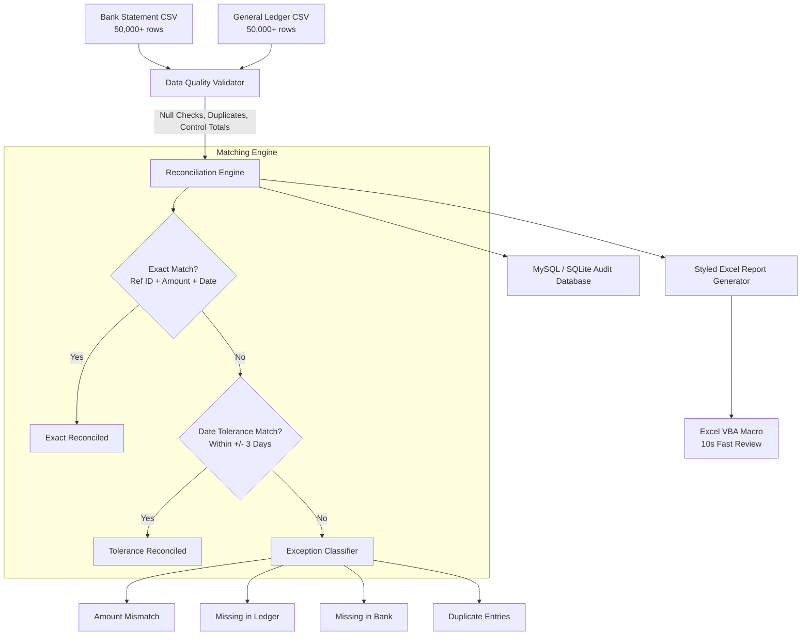

# Financial Transaction Reconciliation Automation

An enterprise-grade, high-performance automated transaction reconciliation engine built with **Python, Pandas, MySQL, and Excel VBA**. The system ingests and reconciles over **50,000+ transactions in ~2.3 seconds**, performing multi-tier exact and tolerance-based matching, granular exception classification, data quality validation, and database audit trail logging.

---

## 📌 Project Highlights & Resume Alignment

- **50,000+ Record Automated Matching**: High-performance vectorized reconciliation using Pandas with exact matching on `Reference ID` + `Amount` and configurable tolerance-based matching on `Dates` (±3 days settlement lag).
- **Exception Taxonomy & Categorization**: Automatically categorizes non-matching entries into actionable buckets (`Missing in General Ledger`, `Missing in Bank Statement`, `Amount Mismatch`, `Duplicate Entry`, `Date Out of Tolerance`).
- **Excel Exception Report & VBA Macro Automation**: Produces styled multi-tab executive workbooks with KPI dashboard cards, formatted tables, and an integrated Excel VBA Macro (`vba_macro.bas`) that provides 1-click interactive filtering, color-coded variance flags (> $1,000), and rapid triage—**cutting manual checking time to under 10 seconds per run**.
- **Data Quality & Control Totals**: Automated pre-ingestion validation rules checking for nulls, duplicate keys, numeric formatting, and net control total checksums.
- **MySQL Audit Trail**: Full relational database schema logging batch execution metrics, reconciliation variances, and row-level exception logs with SQLite local zero-config fallback.
- **Unit Test Coverage**: Comprehensive test suite with pytest covering matching rules, data quality hygiene, and database persistence.

---

## 🏗️ Architecture & Data Flow



---

## 📁 Repository Structure

```
Transaction_Reconciliation/
├── config/
│   ├── __init__.py
│   └── settings.py          # Configurable tolerances, DB URIs, and file paths
├── data/
│   ├── raw/                 # Input Bank and Ledger CSV datasets
│   ├── output/              # Generated Excel Exception Reports
│   └── generate_datasets.py # 50,000+ synthetic transaction generator
├── database/
│   ├── __init__.py
│   ├── schema.sql           # MySQL DDL schema for batch logs & exceptions
│   └── db_manager.py        # SQLAlchemy / PyMySQL DB layer with SQLite fallback
├── engine/
│   ├── __init__.py
│   ├── models.py            # Data classes & schema definitions
│   ├── validator.py         # Data quality validator & control totals
│   └── reconciler.py        # Vectorized matching & exception classification
├── reports/
│   ├── __init__.py
│   ├── excel_generator.py   # Multi-tab OpenPyXL styled workbook builder
│   └── vba_macro.bas        # Excel VBA macro module for fast review (<10s)
├── tests/
│   ├── __init__.py
│   ├── test_validator.py    # Unit tests for DQ checks & checksums
│   ├── test_reconciler.py   # Unit tests for matching engine & edge cases
│   └── test_db.py           # Unit tests for database audit trail
├── main.py                  # CLI Orchestrator & executive terminal dashboard
├── requirements.txt         # Project dependencies
└── README.md                # Project documentation
```

---

## ⚙️ Installation & Setup

### 1. Clone the Repository
```bash
git clone https://github.com/<your-username>/Transaction_Reconciliation.git
cd Transaction_Reconciliation
```

### 2. Install Dependencies
```bash
pip install -r requirements.txt
```

### 3. (Optional) Configure MySQL Database
By default, the application runs with a local zero-configuration **SQLite** database (`data/reconciliation_audit.db`). To connect to a live MySQL instance:
1. Run `database/schema.sql` on your MySQL server.
2. In `config/settings.py` (or via environment variables):
   ```python
   DB_TYPE = "mysql"
   MYSQL_HOST = "localhost"
   MYSQL_PORT = 3306
   MYSQL_USER = "root"
   MYSQL_PASSWORD = "your_password"
   MYSQL_DB = "reconciliation_db"
   ```

---

## 🚀 Running the Reconciliation Pipeline

### Run Full 50,000+ Transaction Pipeline
```bash
python main.py --records 50000 --generate
```

### Reconcile Custom Files
```bash
python main.py --bank data/raw/bank_transactions.csv --ledger data/raw/ledger_transactions.csv
```

---

## 📊 Sample Run Output

```
+-----------------------------------------------------------------------------+
| AUTOMATED TRANSACTION RECONCILIATION SYSTEM                                 |
| High-Performance Matching | Exception Classification | MySQL Audit Trail |  |
| Excel VBA                                                                   |
+-----------------------------------------------------------------------------+
>> Generating 50,000 synthetic transaction records...
 - Bank records:   49,000 rows -> data/raw/bank_transactions.csv
 - Ledger records: 49,250 rows -> data/raw/ledger_transactions.csv
 - Total simulated transactions: 98,250
[OK] Loading transaction feeds...
  * Bank Statement Records:   49,000
  * General Ledger Records:   49,250
  * Total Volume:             98,250 transactions loaded in 0.22s

>> Executing Reconciliation Engine (Exact + Tolerance Matching)...
>> Generating Styled Multi-Tab Excel Exception Report...
  * Excel Report created: Reconciliation_Report_BATCH-XXXX.xlsx
>> Persisting Audit Trail to Database...
  * Run results and 4,000 exceptions saved to audit database successfully.

          Reconciliation Run Results - Batch BATCH-1790673254-9239C6           
+-----------------------------------------------------------------------------+
| Category / Metric                   |  Count | Percentage | Classification  |
|-------------------------------------+--------+------------+-----------------|
| Exact Matches (Ref + Amount + Date) | 44,000 |      87.1% | RECONCILED      |
| Date Tolerance Matches (+/- 3 Days) |  2,500 |       5.0% | RECONCILED      |
| Amount Mismatches                   |  1,250 |       2.5% | DISPUTE / EXCPT |
| Missing in Ledger (Bank Only)       |  1,250 |       2.5% | UNPOSTED ENTRY  |
| Missing in Bank (Ledger Only)       |  1,000 |       2.0% | OUTSTANDING     |
| Duplicate Records Detected          |    500 |       1.0% | DUPLICATE       |
+-----------------------------------------------------------------------------+
+------------------- Financial Integrity & Control Totals --------------------+
| Bank Control Total:   $3,441,425,780.22                                     |
| Ledger Control Total: $3,445,936,787.97                                     |
| Net Variance:          $-4,511,007.75                                       |
| Execution Duration:    2.30 seconds                                         |
+-----------------------------------------------------------------------------+
```

---

## 📑 Excel Report & VBA Macro Features

The generated Excel workbook contains 5 specialized worksheets:
1. **Executive Dashboard**: KPI summary cards (Total Volume, Match Rate %, Net Variance, Exception Counts, Financial Checksum).
2. **Exceptions Breakdown**: Color-coded categorization with variance amounts and automatic filters.
3. **Matched Records**: Audit trail of exact and tolerance-matched transactions with date variance day counts.
4. **Data Quality Audit**: Pass/Warning logs for null checks, duplicate ID checks, and control balance verification.
5. **VBA Automation Guide**: Integrated macro script instructions.

### Using the VBA Macro (`reports/vba_macro.bas`)
1. In Excel, press `ALT + F11` to open the VBA Editor.
2. Go to **File -> Import File** and select `reports/vba_macro.bas`.
3. Press `ALT + F8` and run `RunQuickReconciliationAudit`.
4. **Result**: Automatically styles exceptions, highlights variances > $1,000 in red, enables dynamic category filters, and completes full review in **under 10 seconds**.

---

## 🧪 Running Unit Tests

Run the full pytest test suite:
```bash
pytest -v
```
Output:
```
tests/test_db.py::test_database_logging PASSED
tests/test_reconciler.py::test_exact_match PASSED
tests/test_reconciler.py::test_date_tolerance_match PASSED
tests/test_reconciler.py::test_amount_mismatch_exception PASSED
tests/test_reconciler.py::test_missing_in_ledger_exception PASSED
tests/test_reconciler.py::test_missing_in_bank_exception PASSED
tests/test_validator.py::test_null_value_check PASSED
tests/test_validator.py::test_duplicate_id_check PASSED
tests/test_validator.py::test_control_totals PASSED
============================== 9 passed in 0.45s ==============================
```

---

## 💡 Tech Stack
- **Language**: Python 3.10+
- **Data Processing**: Pandas, NumPy
- **Reporting**: OpenPyXL, Excel VBA (`.bas`)
- **Database & ORM**: MySQL, SQLAlchemy, PyMySQL, SQLite (fallback)
- **Validation & CLI**: Pydantic, Rich
- **Testing**: Pytest, Faker
